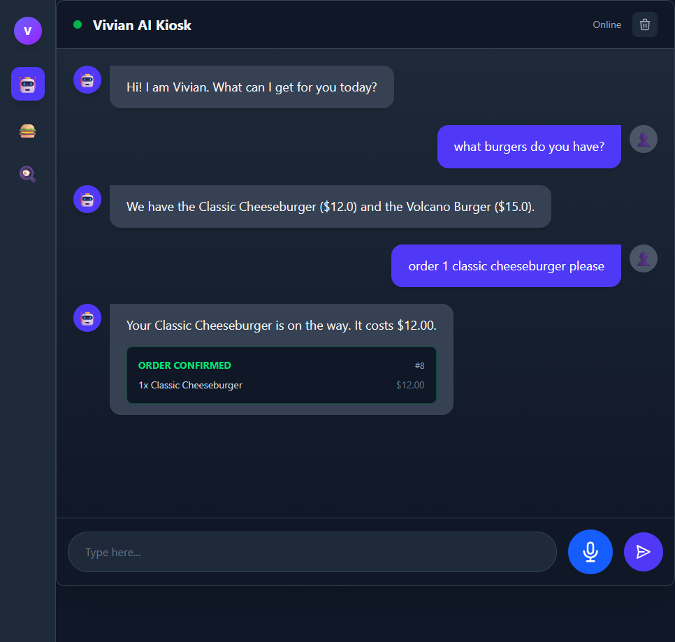
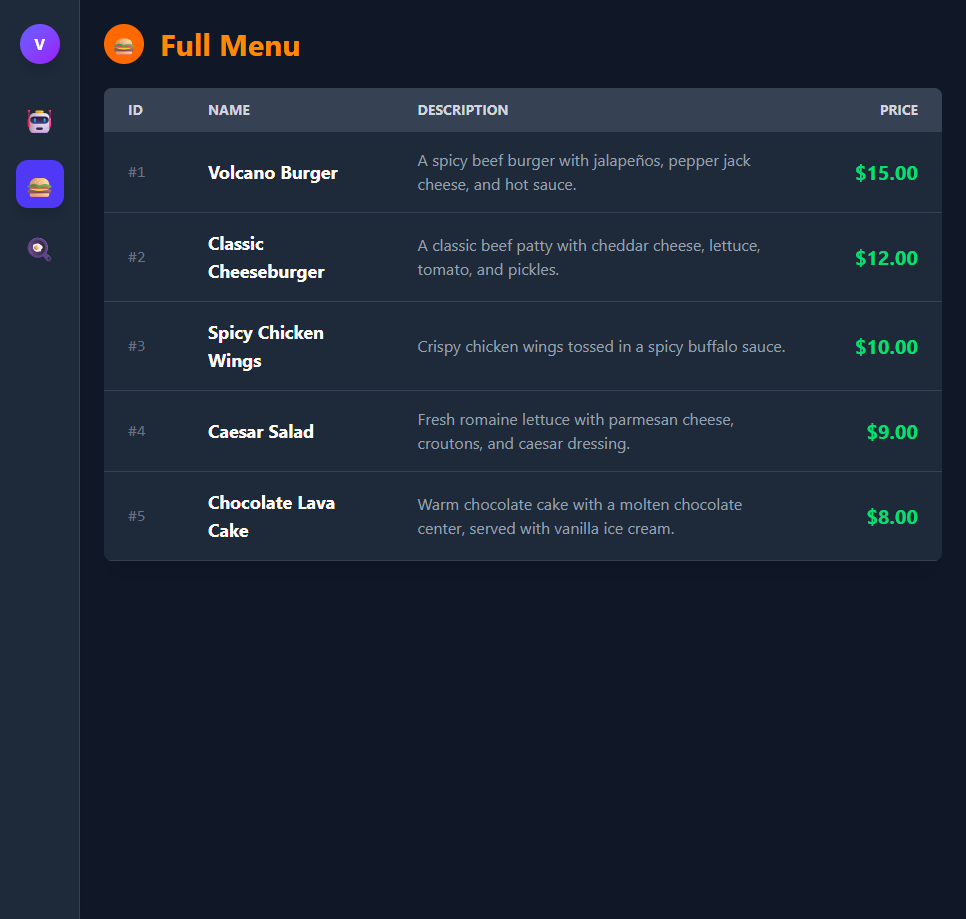
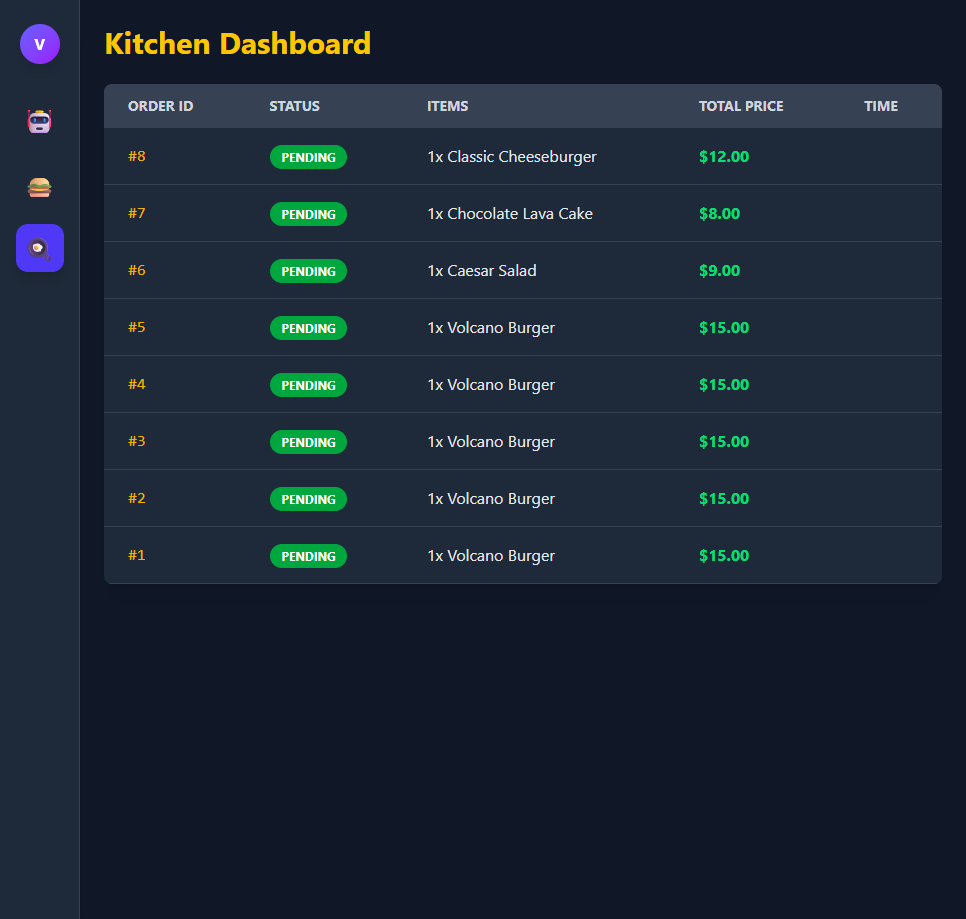

# 🎙️ Voice-Enabled AI Kiosk

A proof of concept for powerful, dual-view AI Kiosk system designed for natural language voice ordering. This project demonstrates a complete **local-first** AI pipeline, from speech-to-text to semantic menu retrieval (RAG) and transactional order processing.

## 📸 Screenshots

| Customer Voice Interface | Kiosks Menu | Kitchen Dashboard |
|:---:|:---:|:---:|
|  |  | 


## ✨ Key Features

- **Voice-to-Voice Ordering:** A seamless "Push-to-Talk" interface powered by the browser's MediaStream API.
- **Dual-View Interface:**
  - **Customer View:** Interactive chat for placing orders using natural language.
  - **Admin Dashboard:** A real-time table displaying order states (Pending vs. Confirmed) directly from Postgres.
- **Local-First AI Pipeline:**
  - **STT:** Faster-Whisper (Int8) for sub-second latency.
  - **LLM:** Integration with local LLM hosts (e.g., LM Studio).
  - **TTS:** High-quality speech synthesis via Qwen3-TTS.
- **RAG (Retrieval-Augmented Generation):** Semantic search for menu items using `pgvector` and `sentence-transformers`.

## 🛠️ Tech Stack

- **Frontend:** Angular v21 (Signals, Standalone Components, Tailwind CSS).
- **Backend:** FastAPI (Python 3.11+), SQLAlchemy.
- **Database:** PostgreSQL with `pgvector` extension.
- **DevOps:** Docker & Docker Compose.

## 🚀 Getting Started

### Prerequisites
- Docker & Docker Compose
- Node.js - v20.19.0 or newer for running Angular V21 [Angular](https://angular.dev/installation)
- LM Studio (running an OpenAI-compatible server at `http://localhost:1234`)
- Qwen3 TTS [Github](https://github.com/QwenLM/Qwen3-TTS)

### Installation & Setup

1. **Clone the repository:**
   ```bash
   git clone https://github.com/dumenu8/voice-ai-kiosk.git
   cd voice-ai-kiosk
   ```

2. **Run with Docker Compose:**
   ```bash
   # Start all services (Database, Backend)
   docker-compose up -d
   ```

3. **Setup the Database & Seed Menu:**
   ```bash
   # Enter the backend container or run locally to seed menu item embeddings
   cd backend
   python seed_menu.py
   ```

4. **Run the Frontend:**
   ```bash
   cd frontend
   npm install
   npm start
   ```

5. **Run the TTS Server:**
   ```bash
   # Ensure qwen3-tts is installed (https://github.com/QwenLM/Qwen3-TTS)
   cd tts_server
   python tts_server.py
   ```

## 📐 Architecture

Detailed system architecture, including data flows and component breakdowns, can be found in the [ARCHITECTURE.md](./ARCHITECTURE.md) file.

## 📄 License
This project is open-source and available under the MIT License.
